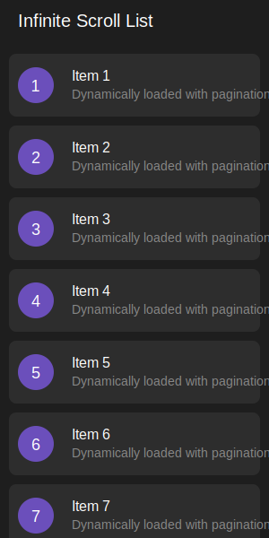

# Infinite Scroll List

A Flutter package that provides an easy-to-use infinite scrolling list widget with built-in loading indicators and pagination support. Perfect for implementing endless scrolling lists, feed interfaces, or any scenario where you need to load data incrementally as the user scrolls.

<p align="center">
  
</p>

## Features

- 🔄 Automatic pagination handling
- 📱 Smooth infinite scrolling experience
- 🎯 Generic type support for any data type
- 🔌 Easy-to-use delegate pattern
- 🎨 Customizable item builders
- ⚡ Built-in loading indicators
- 📦 Minimal setup required

## Installation

Add this to your package's `pubspec.yaml` file:

```yaml
dependencies:
  infinite_scroll_list: ^0.0.1
```

Then run:

```bash
$ flutter pub get
```

## Usage

Here's a simple example of how to use the InfiniteListView:

```dart
InfiniteListView<String>(
  delegate: ItemBuilderDelegate<String>(
    pageRequest: (pageKey) async {
      // Fetch your data here
      return ['Item 1', 'Item 2', 'Item 3'];
    },
    itemBuilder: (context, item, index) => ListTile(
      title: Text(item),
    ),
  ),
)
```

## API Documentation

### InfiniteListView

The main widget that implements the infinite scrolling functionality.

```dart
InfiniteListView<T>(
  delegate: ItemBuilderDelegate<T>(...),
)
```

### ItemBuilderDelegate

Handles the item building and data fetching logic.

Parameters:
- `itemBuilder`: A function that builds the widget for each item
- `pageRequest`: A function that fetches data for the given page
- `pageSize`: Number of items per page (default: 20)

### LoadingIndicator

A customizable loading indicator widget shown during data fetching.

## Example

A more complete example showing how to implement an infinite scrolling list with custom items:

```dart
InfiniteListView<Post>(
  delegate: ItemBuilderDelegate<Post>(
    pageSize: 10,
    pageRequest: (pageKey) async {
      // Simulate API call
      await Future.delayed(Duration(seconds: 1));
      return List.generate(
        10,
        (index) => Post(
          title: 'Post ${pageKey * 10 + index + 1}',
          description: 'Description for post ${pageKey * 10 + index + 1}',
        ),
      );
    },
    itemBuilder: (context, post, index) => Card(
      margin: EdgeInsets.all(8.0),
      child: ListTile(
        title: Text(post.title),
        subtitle: Text(post.description),
      ),
    ),
  ),
)
```

## License

This project is licensed under the MIT License - see the LICENSE file for details.
